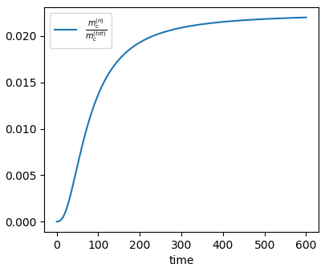
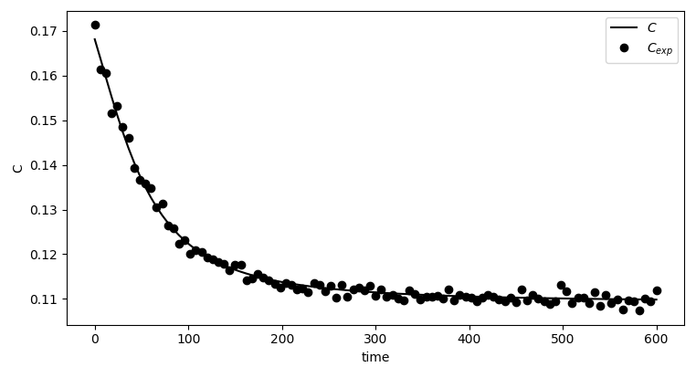
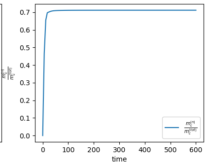
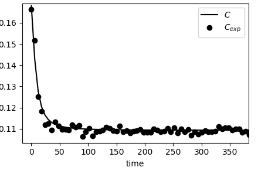
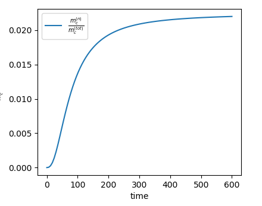
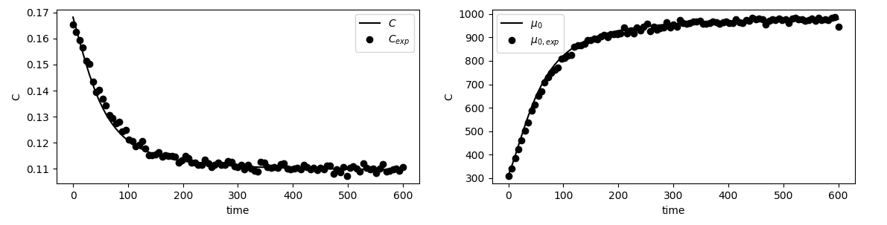

# Parameter Estimation for Crystallization Processes

This work analyze the estimation of kinetics parameters for nucleation, growth and aggregation processes. A simulation considering all three process concurrently using a discretized PBE numerical method is performed and the result is used by a simplified Standard Method of Moments with only nucleation and growth. The capacity for the simple model to represent the completed model is evaluated using as data source liquid measurable variables, solute concentration, and solid phase variables, zero, first and third order moments.

## Growth and Nucleation Only

### Seeded - Only Concentration as data

- In seeded focused experiment, usually the goal is to favour growth instead of nucleation. Thus, the fraction of mass of crystals from nucleated particles may be negligible compared to the mass growing from the seeds. In  such cases, it is not possible to estimate nucleation parameters.

For instance, for a seeded operation with $\frac{m_c^{(n)}}{m_c^{(tot)}}$ as:



The estimation with $k_b=0$, thus without nucletion, gives a good fit:



With the statistics:

```
[[Fit Statistics]]
    # fitting method   = leastsq
    # function evals   = 13
    # data points      = 101
    # variables        = 1
    chi-square         = 1.4564e-04
    reduced chi-square = 1.4564e-06
    Akaike info crit   = -1356.40044
    Bayesian info crit = -1353.78532
[[Variables]]
    kg:  1.4772e+08 +/- 1891388.91 (1.28%) (init = 1.44e+07)
    kb:  0 (fixed)
FIT - Success:
 True
FIT - Message:
 Fit succeeded.
```

Moreover, even in the case with strong nucleation the capacity to estimate nucleation and growth parameters only from concentration is poor. For instance, in the case with $\frac{m_c^{(n)}}{m_c^{(tot)}}$:



And the calculated versus experimental $C$ is:



Need also to check with Unssed operation (**TODO**), however it will probabily show the same result. Thus, it is not possible to accuratly estimate both nucleation and growth kinetics using only liquid phase measurement.

### Seeded - Concentration and $\mu_0$ as data

The parameter estimation was performed using seeds and $\frac{m_c^{(n)}}{m_c^{(tot)}}$ as:



In this case, when the number and concentration is used to perform the estimation, the nucleation and growth kinetics could be determinated.



The estimation report is:

```
[[Fit Statistics]]
    # fitting method   = leastsq
    # function evals   = 3
    # data points      = 101
    # variables        = 2
    chi-square         = 0.05747991
    reduced chi-square = 5.8061e-04
    Akaike info crit   = -750.615465
    Bayesian info crit = -745.385224
[[Variables]]
    kg:  1.7914e+08 +/- 36094448.5 (20.15%) (init = 1.791438e+08)
    kb:  353.296671 +/- 70.1454927 (19.85%) (init = 353.2967)
[[Correlations]] (unreported correlations are < 0.100)
    C(kg, kb) =  1.000
FIT - Success:
 True
FIT - Message:
 One or more variable did not affect the fit.
```

TODO: not sure if the correlation is corrected computed. But nucleation and growth parameter is giving always very high correlation (1.0).

The case with higher nucleation was tested, but the reported correlation was still at 1.0

## Growth, Nucleation and Aggregation as data source

### Constant Aggregation Kernel - Seeded - Small Nucleation


