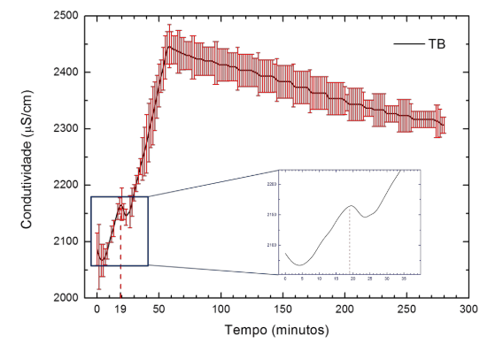
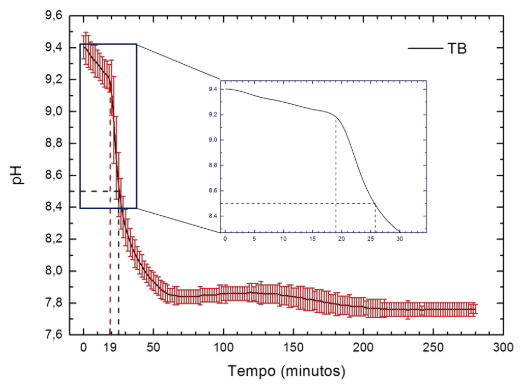
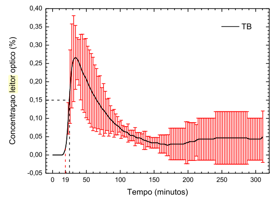
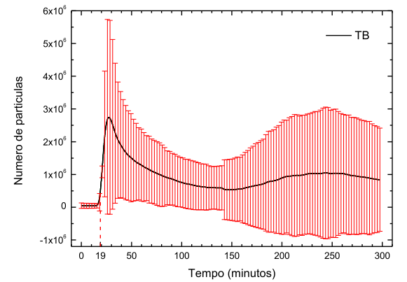
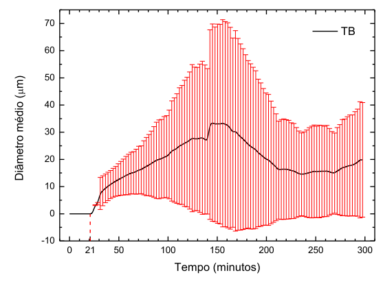

# Model For the Calcite Precipitation with reactants $NaHCO_3$ + $CaCl_2$

- REWRITE FOR VOLUME BASED!

$CaCl_2 + 2 NaHCO_3 \Longleftrightarrow CaCO_3 + 2NaCl + CO_2 + H_2O$

Conditions:

- Fed-batch operation: continuous additions of $CaCl_2$
- No recycle effects are considered (negligible residency time in the measurement loop)
- The initial carbone is all from $NaHCO_3$ in solution (no equlibrium with $CO_2$ for now - required to be fixed)

## TODO:

- Equilibrium of $NaHCO_3$ and air to adjust initial $C$ concentration;
- Check if use the PSD as size based or mass/volume based (what are the implications for growth and aggregation?)

## Mathematical Model

CHECK: use PSD in volume or absolute values ? THis will change the PSD by an additional term and the solute consumption due to crystallization.

### Population Balance

$$\dfrac{\partial n(l,t)}{\partial t} + \dfrac{\partial [G_l(t) n(l,t)]}{\partial l} =
\dot{n}_{add}(l,t) + B_0\delta(l-l_{min}) + R_{l, agg}
$$

Or, using the particle volume based distribution:

$$\dfrac{\partial n(v,t)}{\partial t} + \dfrac{\partial [G(t) n(v,t)]}{\partial v} =
\dot{n}_{add}(v,t) + B_0\delta(v-v_{min}) + R_{agg}
$$

Applying the MSM without particle addition:

$$\dfrac{d N_0(t)}{dt} = B_0 + R_{agg,0}$$

$$\dfrac{d N_i(t)}{dt} = R_{agg, i}$$

$$\dfrac{dx_i}{dt} = G(x_i)$$

$$ R_{agg} = \sum_{\underset{x_{i-1}(t) \leq \nu(t) \leq x_{i+1}(t)}{j,k}}^{i \geq j\geq k} (1-\frac{1}{2} \delta_{j,k})\eta
					q_{j,k} N_j(t)N_k(t) - N_i(t)\sum_{k=1}^{M}q_{i,k}N_k(t) $$

$$\scriptsize \eta = \begin{cases}
                \dfrac{x_{i+1}(t) - \nu}{x_{i+1}(t)-x_i(t)}\text{, } x_i(t) \leq \nu \leq x_{i+1}(t) \\
                \dfrac{x_{i-1}(t) - \nu}{x_{i-1}(t)-x_i(t)}\text{, } x_{i-1}(t) \leq \nu \leq x_{i}(t)
\end{cases}
$$

$$ \nu(t) = x_j(t)+x_k(t)$$

### Mass Balances for Total species in Liquid Phase

$$\dfrac{dm_{Ca}}{dt} = Q_{in}C_{Ca,in} + \xi_{Ca} \dfrac{dm_{c,tot}}{dt}$$

$$\dfrac{dm_{C}}{dt} = \xi_{C} \dfrac{dm_{c,tot}}{dt}$$

$$\dfrac{dm_{Na^{+}}}{dt} = 0$$

$$\dfrac{dm_{Cl^{-}}}{dt} = Q_{in}C_{Cl^{-},in}$$

$$\dfrac{dV(t)}{dt} = Q_{in}$$

The rate of consumption of solute to the solid phase for size based is:

$$ r_{p,l} = -\left(3\rho_c k_v \int G l^2 n(l,t) dl \right)$$

However, since it is being working with volume (independent coordinate) based PSD:

$$m_{c,tot} = \rho_c k_v v_{c,t}$$

$$ v_{c,t} = \int_0^{\infty} n(v,t) v dv$$

$$ m_{c,tot} = \rho_c k_v \int_0^{\infty} n(v,t) v dv$$

The derivative is thus:

$$ \dfrac{dm_{c,tot}}{dt} = \rho_c k_v \dfrac{d}{dt}[\int_0^{\infty} n(v,t) v dv]$$

$$ \dfrac{dm_{c,tot}}{dt} = \rho_c k_v \int_0^{\infty} n(v,t) G(v) dv$$

If PSD is volumetric:

$$m_{c,tot} = \rho_c k_v v_{c,t} V(t)$$

$$\dfrac{m_{c,tot}}{V(t)} = \rho_c k_v v_{c,t}$$

$$\dfrac{d \left[\dfrac{m_{c,tot}}{V(t)}\right]}{dt}  = r_p = \rho_c k_v \int_0^{\infty} n(v,t) G(v) dv$$

#### The fractions of species are:

$$\xi_{Ca} = \dfrac{M_{Ca}}{M_{CaCO_3}}$$

$$\xi_{C} = \dfrac{M_{C}}{M_{CaCO_3}}$$

#### The concentration [$g/mL$] for species $Ca$ and $Cl$ in the feed stream are:

$$C_{Ca,in} = \dfrac{M_{Ca}}{M_{CaCl_2}} C_{CaCl_2,in}$$

$$C_{Cl,in} = 2\dfrac{M_{Cl}}{M_{CaCl_2}} C_{CaCl_2,in}$$

Additionally, even though not required to close the ODE system, the added quantity of $CaCl$ can be tracked by:

$$\dfrac{dm_{CaCl}}{dt} = Q_{in}C_{CaCl,in}$$

### Supersaturation Equation

$$S = \dfrac{\gamma_{Ca^{2+}} x_{Ca^{2+}} \gamma_{CO^{2-}} x_{CO^{2-}}}{K_{sp}}$$

### Equilibrium constant

Equilibrium constant from Torraca thesis for Calcite:

$$K_{sp} = -171.906 - 0.0779 T + 2839.319/T + 71.595 \log_{10}T$$

However, they will be obtained from Elvis module (REQUIRES UPDATE):

`calciumcarbonate_supersaturation_module.py`

The equilibrium module from Elvis used molar concentration in [$g/L$] (CHECK), thus the following auxiliary equations are requires:

### Auxiliaries equations

$$m_{slv} = \rho_{mix} V(t)$$

$$\rho_{mix} \approx \rho_{w}$$

$$c_{j} = \dfrac{m_{j}}{m_{slv}(t)}$$

$$c_{Ca} = \dfrac{m_{Ca}}{M_{Ca} V_L}$$

$$c_{C} = \dfrac{m_{C}}{M_{C} V_L}$$

$$c_{Na} = \dfrac{m_{Na}}{M_{Na} V_L}$$

$$c_{Cl} = \dfrac{m_{Cl}}{M_{Cl} V_L}$$

### Precipitation Kinetics

#### Growth

Potential References:

- A two-fluid model for calcium carbonate precipitation in highly supersaturated solutions (USED)

$$G(t) = k_g (S - 1)^g$$

From @reis2018two: $g=2$ and $k_g$ is:

$$\log{k_g} = -0.275 + 0.228 \left[ \dfrac{I^{1/2}}{1 + I^{1/2}} - 0.3I \right]$$

where $I$ is the ionic strength ($mol/L$) and $k_g[=]nm/s$.

@Verdoes1992 provides the growth kinetics in a similar form, but with $g=1.8$ and $k_g = 2.4e-12 m/s$

#### Nucleation

The conventional equation for nucleation in the form:

$$B_0(t) = k_b (S - 1)^b \mu_3(t)$$

Or, from @reis2018two:

$$B_0(t) = A \exp{\left[ - \dfrac{\beta \sigma^3 \nu^2 }{2.30 k_b^3 T^3 (\log{S})^2}\right]}$$

where $\beta = 16.75$ for spherically symmetric particles, $\sigma = 0.068 N/m$; $\nu = 6.132 \cdot 10^{-29}$. An approximation for $A$ is given:

$$A = \dfrac{D}{\epsilon^5 S^{5/3}}$$

$$D = 8.67 \cdot 10^{-10} m^2/s \text{ and } \epsilon = 7.62\cdot 10^{-10}$$

However, the profile for nucleation using @reis2018two is not reasonable for the working range of Supersaturation. It is reported a supersaturation of $S = 3235.94$, but the equation for supersaturation is not provided.

Another reference for nucleation of $CaCO_3$ is @Verdoes1992, with the following equation:

$$B_0 = K_s S \exp \left(-\dfrac{E_b}{\ln^2 S} \right) $$

where $K_s = 1.4e18 1/m^3/s$ and $E_b = 12.8$

### Aggregation

$$q(x_i, x_j) = TO DO$$

## Conductance

The electrical conductance was estimated from Appelo modified Nernst-Einstein equation (see: http://www.aqion.de/site/77#Nernst-Einstein):

$$EC \ = \ \sum\limits_i \, \Lambda_{m,i}^0 \, (\gamma_i)^{\alpha} \, c_i\ $$

$$
\alpha \ = \ \begin{cases} \ 0.6 \,/ \mid\! z_i\!\mid^{0.5} = const & \ \text{if } I\leq 0.36 \mid\! z_i\mid \\ \sqrt{I} \, / \mid\! z_i\mid  &  \text{otherwise } \end{cases}$$

The values for $\Lambda_0$ for each ion is listed in XXX.

### Initial Conditions:

#### PSD:

No Seed at initial time: $N_i = 0$

$0 \leq x_i \leq 10 \mu m$

#### Components Concentration and Masses

$$ V(0) = 600 cm^3$$
$$ C_{NaHCO_3}(0) = 1.2275 \cdot 10^{-3} g/cm^3$$

$$m_{Ca^{2+}}(0) = 0$$

$$m_{C}(0) = \dfrac{M_{C}}{M_{NaHCO_3}} C_{NaHCO_3}(0) V(0)$$

$$m_{Na}(0) = \dfrac{M_{Na}}{M_{NaHCO_3}} C_{NaHCO_3}(0) V(0)$$

$$m_{Cl}(0) = 0$$

## Parameters

### Operational Conditions

Parameter | Value | Unit
-------- | ----- | -----
$C_{NaHCO_3}(0)$ | $1.2275 \cdot 10^{-3}$ | $g/cm^3$
$C_{CaCl,in}$ |  $0.7275 \cdot 10^{-3}$ | $g/cm^3$
$V(0)^*$ | 600 | $cm^3$
$T$ | 25 | $^\circ{C}$
$RPM$ | 350 | rpm
$Q_{in}$ | 1.75  | $cm^3/min$
$t_f$ | 56 | min

*: confirm initial volume

### Physico-chemical parameters

Parameter | Value | Unit
-------- | ----- | -----
$M_{C}$ | 12.0707 | $g/mol$
$M_{Na}$ | 22.99 | g/mol
$M_{NaHCO_3}$ | 84.007 | $g/mol$
$M_{CaCl_2}$ | 110.98 | $g/mol$
$M_{Ca}$ | 40.078 | $g/mol$
$M_{Cl}$ | 35.453 | $g/mol$
$\rho_w$ | $1$ | $g/cm^3$

## Kinetic parameters

to do

## Conductance Parameters

Substance | abs(z) | Di 1e-9 [m^2/s] | $\Lambda_{m,i}^0$ [ S $cm^2$ $mol^{-1}$]$
---- | ---- | ---- | ----
Na+ | 1 | 1.330	| 50.0
H+ | 1 | 9.310 |	349.6
Ca++ | 2 | 0.793 |	119.1
Cl-	|1 |	2.030 |	76.2
HCO3- |	1 |	1.180 |	44.3
NaCO3- | 1 |	0.585 |	22.0
OH- |	1 |	5.270 |	197.9
CO3-- | 2 | 0.955 |	143.5
CaOH+ | 1 | |
CaHCO3+ | 1 | 0.506 |	19.0

## Experimentos - Torraca, 2018

Teste Branco (sem campo magnético)

# References

