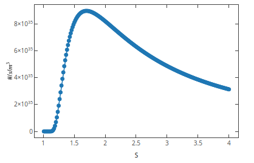

# Simulation Results for the Calcite Precipitation with reactants $NaHCO_3$ + $CaCl_2$ with Nucleation and Growth only during Addition period

Analysed cases:

- Supersaturation:

$$S = \sqrt{\dfrac{\gamma_{Ca^{2+}} x_{Ca^{2+}} \gamma_{CO^{2-}} x_{CO^{2-}}}{K_{sp}}}$$

and

$$S = \dfrac{\gamma_{Ca^{2+}} x_{Ca^{2+}} \gamma_{CO^{2-}} x_{CO^{2-}}}{K_{sp}}$$

- Growth rates:

1. @reis2018two:

$$G(t) = k_g (S - 1)^2$$

$$\log{k_g} = -0.275 + 0.228 \left[ \dfrac{I^{1/2}}{1 + I^{1/2}} - 0.3I \right]$$

2. @Verdoes1992

$$G(t) = k_g (S - 1)^1.8$$

@Verdoes1992 provides the growth kinetics in a similar form, but with $g=1.8$ and $k_g = 2.4e-12 m/s$

- Nucleation

1. @reis2018two:

$$B_0(t) = A \exp{\left[ - \dfrac{\beta \sigma^3 \nu^2 }{2.30 k_b^3 T^3 (\log{S})^2}\right]}$$

where $\beta = 16.75$ for spherically symmetric particles, $\sigma = 0.068 N/m$; $\nu = 6.132 \cdot 10^{-29}$. An approximation for $A$ is given:

$$A = \dfrac{D}{\epsilon^5 S^{5/3}}$$

$$D = 8.67 \cdot 10^{-10} m^2/s \text{ and } \epsilon = 7.62\cdot 10^{-10}$$

2. @Verdoes1992

$$B_0 = K_s S \exp \left(-\dfrac{E_b}{\ln^2 S} \right) $$

where $K_s = 1.4e18 1/m^3/s$ and $E_b = 12.8$

## Results

Case | Eq. S. | Growth | Nucleation | Note
----- | ---- | ---- | ---- | ------
1 | sqrt | Reis | Reis | Failed - Nucleation low for working $S$
2 | sqrt | Reis | Verdoes | Ok.
3 | sqrt | Verdoes | Reis | Not tested See (1)
4 | sqrt | Verdoes | Verdoes | Failed - Growth low (check the modification)
5 | sqrt | Verdoes-Mod | Verdoes | Issues with sundials but running
6 | non sqrt | Reis | Reis | Not tested See (1)
7 | non sqrt | Reis | Verdoes | Not tested
8 | non sqrt | Verdoes | Reis | Not tested
9 | non sqrt | Verdoes | Verdoes | Not tested

### Case (1)

(1 | sqrt | Reis | Reis)

Numerical error when using Reis Nucleation Rate.

### Case (2)

(2 | sqrt | Reis | Verdoes)

### Case (4)

(4 | sqrt | Verdoes | Verdoes)

Numerical error when using Verdoes Growth Rate. The author suggest other references using $K_g \cdot 10^{2}$

#### Case (5)

#### Case (6)

(6 | non sqrt | Reis | Reis)

#### Case - Partial Result: Using new pH calculation method

(Not listed yet | non sqrt | Reis | Verdoes)

(Not listed yet | sqrt | Reis | Verdoes)

