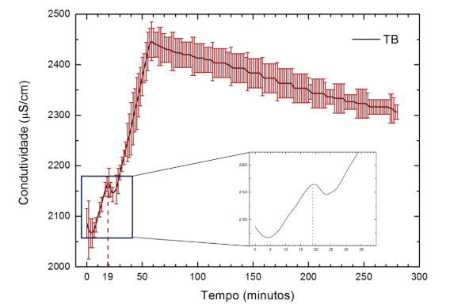
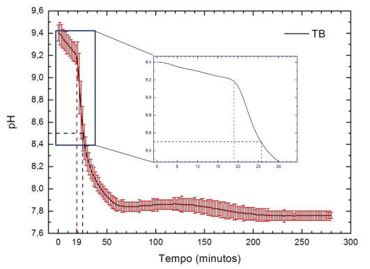
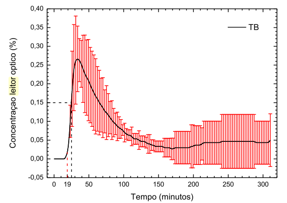
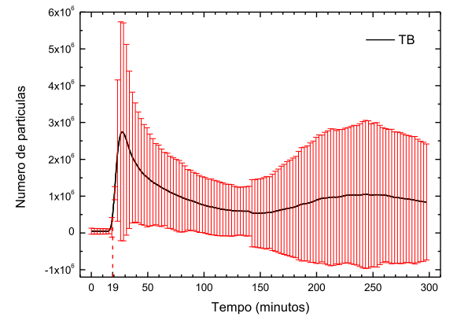
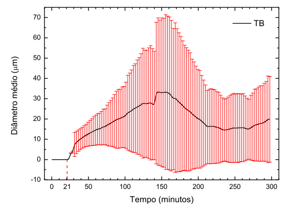

Model For the Calcite Precipitation with reactants $NaHCO_3$ + $CaCl_2$
=======================================================================

-   REWRITE FOR VOLUME BASED!

$CaCl_2 + 2 NaHCO_3 \Longleftrightarrow CaCO_3 + 2NaCl + CO_2 + H_2O$

Conditions:

-   Fed-batch operation: continuous additions of $CaCl_2$
-   No recycle effects are considered (negligible residency time in the
    measurement loop)
-   The initial carbone is all from $NaHCO_3$ in solution (no equlibrium
    with $CO_2$ for now - required to be fixed)

TODO:
-----

-   Equilibrium of $NaHCO_3$ and air to adjust initial $C$
    concentration;
-   Check if use the PSD as size based or mass/volume based (what are
    the implications for growth and aggregation?)

Mathematical Model
------------------

CHECK: use PSD in volume or absolute values ? THis will change the PSD
by an additional term and the solute consumption due to crystallization.

### Population Balance

$$\dfrac{\partial n(l,t)}{\partial t} + \dfrac{\partial [G_l(t) n(l,t)]}{\partial l} =
\dot{n}_{add}(l,t) + B_0\delta(l-l_{min}) + R_{l, agg}
$$

Or, using the particle volume based distribution:

$$\dfrac{\partial n(v,t)}{\partial t} + \dfrac{\partial [G(t) n(v,t)]}{\partial v} =
\dot{n}_{add}(v,t) + B_0\delta(v-v_{min}) + R_{agg}
$$

Applying the MSM without particle addition:

$$\dfrac{d N_0(t)}{dt} = B_0 + R_{agg,0}$$

$$\dfrac{d N_i(t)}{dt} = R_{agg, i}$$

$$\dfrac{dx_i}{dt} = G(x_i)$$

$$ R_{agg} = \sum_{\underset{x_{i-1}(t) \leq \nu(t) \leq x_{i+1}(t)}{j,k}}^{i \leq j\leq k} (1-\frac{1}{2} \delta_{j,k})\eta
                    q_{j,k} N_j(t)N_k(t) - N_i(t)\sum_{k=1}^{M}q_{i,k}N_k(t) $$

$$\scriptsize \eta = \begin{cases}
                \dfrac{x_{i+1}(t) - \nu}{x_{i+1}(t)-x_i(t)}\text{, } x_i(t) \leq \nu \leq x_{i+1}(t) \\
                \dfrac{x_{i-1}(t) - \nu}{x_{i-1}(t)-x_i(t)}\text{, } x_{i-1}(t) \leq \nu \leq x_{i}(t)
\end{cases}
$$

$$ \nu(t) = x_j(t)+x_k(t)$$

### Mass Balances for Total species in Liquid Phase

$$\dfrac{dm_{Ca}}{dt} = Q_{in}C_{Ca,in} + \xi_{Ca} \dfrac{dm_{c,tot}}{dt}$$

$$\dfrac{dm_{C}}{dt} = \xi_{C} \dfrac{dm_{c,tot}}{dt}$$

$$\dfrac{dm_{Na^{+}}}{dt} = 0$$

$$\dfrac{dm_{Cl^{-}}}{dt} = Q_{in}C_{Cl^{-},in}$$

$$\dfrac{dV(t)}{dt} = Q_{in}$$

The rate of consumption of solute to the solid phase for size based is:

$$ r_{p,l} = -\left(3\rho_c k_v \int G l^2 n(l,t) dl \right)$$

However, since it is being working with volume (independent coordinate)
based PSD:

$$m_{c,tot} = \rho_c k_v v_{c,t}$$

$$ v_{c,t} = \int_0^{\infty} n(v,t) v dv$$

$$ m_{c,tot} = \rho_c k_v \int_0^{\infty} n(v,t) v dv$$

The derivative is thus:

$$ \dfrac{dm_{c,tot}}{dt} = \rho_c k_v \dfrac{d}{dt}[\int_0^{\infty} n(v,t) v dv]$$

$$ \dfrac{dm_{c,tot}}{dt} = \rho_c k_v \int_0^{\infty} n(v,t) G(v) dv$$

If PSD is volumetric:

$$m_{c,tot} = \rho_c k_v v_{c,t} V(t)$$

$$\dfrac{m_{c,tot}}{V(t)} = \rho_c k_v v_{c,t}$$

$$\dfrac{d \left[\dfrac{m_{c,tot}}{V(t)}\right]}{dt}  = r_p = \rho_c k_v \int_0^{\infty} n(v,t) G(v) dv$$

#### The fractions of species are:

$$\xi_{Ca} = \dfrac{M_{Ca}}{M_{CaCO_3}}$$

$$\xi_{C} = \dfrac{M_{C}}{M_{CaCO_3}}$$

#### The concentration \[$g/mL$\] for species $Ca$ and $Cl$ in the feed stream are:

$$C_{Ca,in} = \dfrac{M_{Ca}}{M_{CaCl_2}} C_{CaCl_2,in}$$

$$C_{Cl,in} = 2\dfrac{M_{Cl}}{M_{CaCl_2}} C_{CaCl_2,in}$$

Additionally, even though not required to close the ODE system, the
added quantity of $CaCl$ can be tracked by:

$$\dfrac{dm_{CaCl}}{dt} = Q_{in}C_{CaCl,in}$$

### Supersaturation Equation

$$S = \dfrac{\gamma_{Ca^{2+}} x_{Ca^{2+}} \gamma_{CO^{2-}} x_{CO^{2-}}}{K_{sp}}$$

### Equilibrium constant

Equilibrium constant from Torraca thesis for Calcite:

$$K_{sp} = -171.906 - 0.0779 T + 2839.319/T + 71.595 \log_{10}T$$

However, they will be obtained from Elvis module (REQUIRES UPDATE):

`calciumcarbonate_supersaturation_module.py`

The equilibrium module from Elvis used molar concentration in \[$g/L$\]
(CHECK), thus the following auxiliary equations are requires:

### Auxiliaries equations

$$m_{slv} = \rho_{mix} V(t)$$

$$\rho_{mix} \approx \rho_{w}$$

$$c_{j} = \dfrac{m_{j}}{m_{slv}(t)}$$

$$c_{Ca} = \dfrac{m_{Ca}}{M_{Ca} V_L}$$

$$c_{C} = \dfrac{m_{C}}{M_{C} V_L}$$

$$c_{Na} = \dfrac{m_{Na}}{M_{Na} V_L}$$

$$c_{Cl} = \dfrac{m_{Cl}}{M_{Cl} V_L}$$

### Precipitation Kinetics

#### Growth

Potential References:

-   A two-fluid model for calcium carbonate precipitation in highly
    supersaturated solutions (USED)

$$G(t) = k_g (S - 1)^g$$

From @reis2018two: $g=2$ and $k_g$ is:

$$\log{k_g} = -0.275 + 0.228 \left[ \dfrac{I^{1/2}}{1 + I^{1/2}} - 0.3I \right]$$

where $I$ is the ionic strength ($mol/L$) and $k_g[=]nm/s$.

@Verdoes1992 provides the growth kinetics in a similar form, but with
$g=1.8$ and $k_g = 2.4e-12 m/s$

#### Nucleation

The conventional equation for nucleation in the form:

$$B_0(t) = k_b (S - 1)^b \mu_3(t)$$

Or, from @reis2018two:

$$B_0(t) = A \exp{\left[ - \dfrac{\beta \sigma^3 \nu^2 }{2.30 k_b^3 T^3 (\log{S})^2}\right]}$$

where $\beta = 16.75$ for spherically symmetric particles,
$\sigma = 0.068 N/m$; $\nu = 6.132 \cdot 10^{-29}$. An approximation for
$A$ is given:

$$A = \dfrac{D}{\epsilon^5 S^{5/3}}$$

$$D = 8.67 \cdot 10^{-10} m^2/s \text{ and } \epsilon = 7.62\cdot 10^{-10}$$

However, the profile for nucleation using @reis2018two is not reasonable
for the working range of Supersaturation. It is reported a
supersaturation of $S = 3235.94$, but the equation for supersaturation
is not provided.

Another reference for nucleation of $CaCO_3$ is @Verdoes1992, with the
following equation:

$$B_0 = K_s S \exp \left(-\dfrac{E_b}{\ln^2 S} \right) $$

where $K_s = 1.4e18 1/m^3/s$ and $E_b = 12.8$

### Aggregation

$$q(x_i, x_j) = TO DO$$

Conductance
-----------

The electrical conductance was estimated from Appelo modified
Nernst-Einstein equation (see:
http://www.aqion.de/site/77\#Nernst-Einstein):

$$EC \ = \ \sum\limits_i \, \Lambda_{m,i}^0 \, (\gamma_i)^{\alpha} \, c_i\ $$

$$
\alpha \ = \ \begin{cases} \ 0.6 \,/ \mid\! z_i\!\mid^{0.5} = const & \ \text{if } I\leq 0.36 \mid\! z_i\mid \\ \sqrt{I} \, / \mid\! z_i\mid  &  \text{otherwise } \end{cases}$$

The values for $\Lambda_0$ for each ion is listed in XXX.

### Initial Conditions:

#### PSD:

No Seed at initial time: $N_i = 0$

$0 \leq x_i \leq 10 \mu m$

#### Components Concentration and Masses

$$ V(0) = 600 cm^3$$ $$ C_{NaHCO_3}(0) = 1.2275 \cdot 10^{-3} g/cm^3$$

$$m_{Ca^{2+}}(0) = 0$$

$$m_{C}(0) = \dfrac{M_{C}}{M_{NaHCO_3}} C_{NaHCO_3}(0) V(0)$$

$$m_{Na}(0) = \dfrac{M_{Na}}{M_{NaHCO_3}} C_{NaHCO_3}(0) V(0)$$

$$m_{Cl}(0) = 0$$

Parameters
----------

### Operational Conditions

  Parameter          Value                    Unit
  ------------------ ------------------------ -------------
  $C_{NaHCO_3}(0)$   $1.2275 \cdot 10^{-3}$   $g/cm^3$
  $C_{CaCl,in}$      $0.7275 \cdot 10^{-3}$   $g/cm^3$
  $V(0)^*$           600                      $cm^3$
  $T$                25                       $^\circ{C}$
  $RPM$              350                      rpm
  $Q_{in}$           1.75                     $cm^3/min$
  $t_f$              56                       min

\*: confirm initial volume

### Physico-chemical parameters

  Parameter       Value     Unit
  --------------- --------- ----------
  $M_{C}$         12.0707   $g/mol$
  $M_{Na}$        22.99     g/mol
  $M_{NaHCO_3}$   84.007    $g/mol$
  $M_{CaCl_2}$    110.98    $g/mol$
  $M_{Ca}$        40.078    $g/mol$
  $M_{Cl}$        35.453    $g/mol$
  $\rho_w$        $1$       $g/cm^3$

Kinetic parameters
------------------

to do

Conductance Parameters
----------------------

  Substance   abs(z)   Di 1e-9 \[m\^2/s\]   $\Lambda_{m,i}^0$ \[ S $cm^2$ $mol^{-1}$\]\$
  ----------- -------- -------------------- ----------------------------------------------
  Na+         1        1.330                50.0
  H+          1        9.310                349.6
  Ca++        2        0.793                119.1
  Cl-         1        2.030                76.2
  HCO3-       1        1.180                44.3
  NaCO3-      1        0.585                22.0
  OH-         1        5.270                197.9
  CO3--       2        0.955                143.5
  CaOH+       1                             
  CaHCO3+     1        0.506                19.0

Experimentos - Torraca, 2018
----------------------------

Teste Branco (sem campo magnético)

