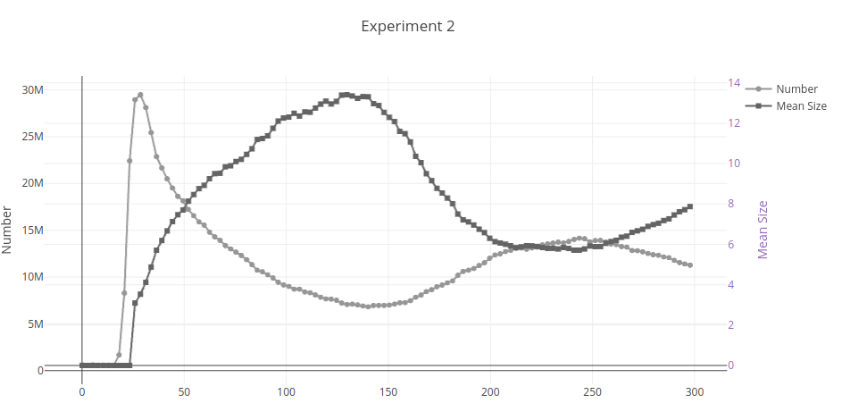

# Parameter Estimation for Aggregation, Nucleation and Growth Simple Case

Parameter estimation are performed using simplified functions for aggregation, nucleation and growth.

The goal is to obtain the profile for number and mean size with varying slope, such as:

## Description

- model.py: PBE Model
- data.py: data manipulation for parameter estimation
- utils.py: miscellaneous auxiliary functions
